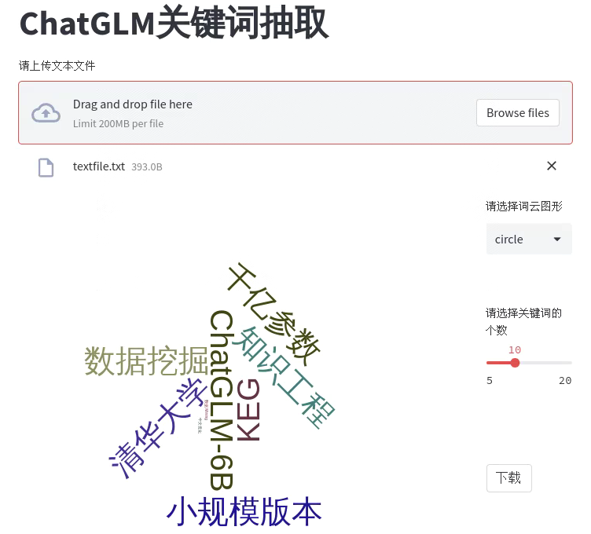
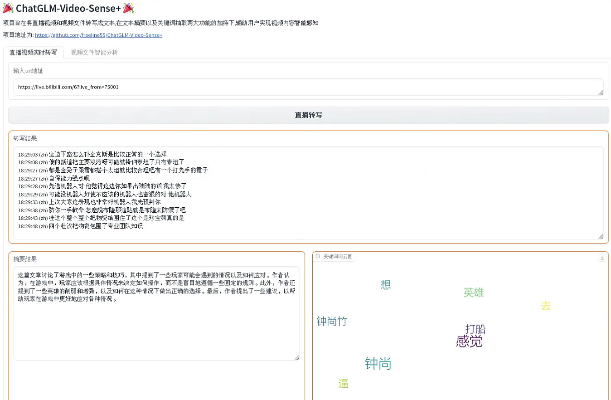
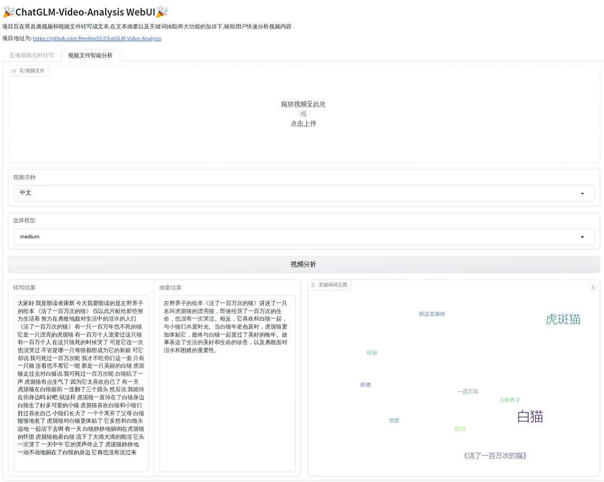
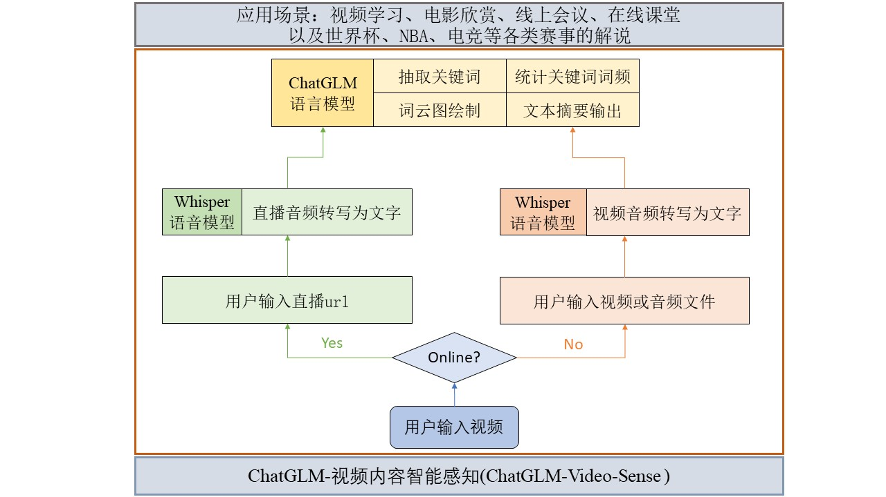

# ChatGLM-Video-Sense

## 1. 项目灵感来源

随着大语言模型技术的快速发展，利用大模型构建的应用百花齐放。在Datawhale五月《大模型应用开发》的组队学习过程中，我们对学习手册中的Langchain选修部分很感兴趣，并打算在学习课程之后，构建一个属于我们自己的有意思、有意义的应用，同时我们也希望为开源社区贡献一份微薄之力。

通过调研往期的优秀开源项目并结合我们小队内部人员学习和工作特点，我们发现利用语言大模型处理其他模态数据的缺口很大，而且应用场景非常广阔，是一个值得研究的方向。举几个例子：

- 你是否经常看到 `800G人工智能全套学习资料，不可错过！` 这种标题的文章？看不完，根本看不完！🫠

- 你是否经常在B站上刷到这种动辄上百小时、几百集的在线视频？反正我是看见标题连点进去的勇气都没有，就问你怕不怕！😂

- 作为学生，你是否经常苦恼跟不上老师的节奏，恨不得把老师讲的每一个字都记下来，你确定能记得过来？🤔

思虑再三，我们决定做一个智能视频处理工具。我们项目的名称为ChatGLM-Video-Sense，旨在基于ChatGLM语言大模型实现视频内容智能感知。我们将大语言模型应用在离线视频内容整理和总结上，典型的应用场景包括视频学习和电影欣赏等；同时我们的项目还支持在线直播的实时转写以及摘要生成和关键词抽取，这种模式可以应用在线上会议和线上课堂中，便于我们记录会议和课程的文字稿，还可以快速整理会议纪要、学习笔记，提升工作、学习效率；另外，我们惊喜的发现本项目还可以用于世界杯、NBA以及电竞等各类赛事的直播。

我们衷心希望我们所构建的这款应用ChatGLM-Video-Sense能够帮助对大家的工作和生活有所帮助，请大家支持和关注！

## 2. 功能及应用场景介绍

本项目的主要功能主要分为两个部分：

- 分析 文本/文章： [第一阶段作业](https://github.com/freeline55/ChatGLM-Keyword.git)
  
  - 用户在上传需要进行分析的文本或文章时，可以自定义统计关键词的数量。
  
  - 项目能够对用户上传的文本或文章进行关键词的抽取操作，并统计关键词的词频在前端界面呈现给用户。
  
  - 项目对抽取出的关键词进行词云图的绘制，并展现在前端界面。
  
  - 用户可以在前端界面手动对词云图效果进行更换。

- 分析 在线/离线视频：
  
  - 项目可以对在线视频、离线视频和音频进行分析。
  
  - 用户在上传在线视频网址、离线视频mp4文件文件后，项目会首先通过音频转文字将视频的文字内容整理成文字稿呈现给用户，这样用户如果时间有限，就可以通过文字稿快速了解视频的大致内容。
  
  - 项目还可以通过关键词抽取和文本摘要生成两个功能让用户快速掌握视频的核心内容。关键词抽取的整体流程和分析文本/文章的流程相同，还可以通过关键词的词频和词云图帮助用户加深对要点知识的理解。文本摘要生成就是在文字稿的内容上进一步总结形成摘要性质的文本信息。

- 本项目的主要应用场景有以下几个：
  - 线下课程以及电影欣赏
    - 在线下课程场景中，教师的教学内容通常是不能二次回看的，所以大部分学生可能会采用录音的方式记录课程的整体内容，下课后进行反复聆听学习。我们的项目可以帮助这类学生处理他们手上拥有的录音形成文字稿或者文本摘要，帮助学生快速get到课程的核心内容。包括考研、编程、职场、运动、做饭等各类课程的离线视频都可以使用本项目快速形成摘要内容，快速获取核心内容。用户还可以使用本项目将感兴趣的电影转成文字，用于摘录经典台词、记录电影主要内容等。

  - 在线课程、线上会议和在线直播
    - 在线模式
      - 处于在线模式时，直播、会议和课程通常都会有一个对应的在线链接，用户通过点击链接进入到这些场景中，这时我们的项目可以读取在线链接并将音频转写成文本，形成文本稿，再根据用户的需求来决定是否还需要使用关键词抽取和文本摘要生成功能。

    - 离线模式
      - 处于离线模式时，直播、会议和课程通常都会被用户下载成一个Mp4文件，用户在项目中上传Mp4文件，项目可以读取该文件并将音频转写成文本，形成文本稿，再根据用户的需求来决定是否还需要使用关键词抽取和文本摘要生成功能。

  - 世界杯、NBA、电竞等各类赛事的直播解说
    - 观看直播的过程中，最担心的就是中间临时有事无法及时观看，使用本项目就可以实时转成文字稿，任意时刻返回都能接上进度。另外，本项目会定时将已经转写的文字生成摘要，也可以辅助用户掌握直播的核心内容。

## 3. 主要技术及效果展示

本项目在实现上将`Whisper`语音大模型和`ChatGLM`语言大模型进行了有效集成，实现了两个模型的接口组合，为语言模型添加了视频处理能力。总体架构图如下：

- 分析 文本/文章：这部分主要采用的核心技术是`LangChain-ChatGLM`和`Echarts`，其中`LangChain-ChatGLM`用来抽取文本内容中的关键词并统计每个关键词对应的词频，`Echarts`被作用到前端用于针对关键词生成词云图，即将关键词以可视化的形成呈现给用户。

- 分析 在线/离线视频：
  
  - 视频转写文本：项目使用OpenAI开源的`Whisper`语音大模型用于视频转写，使用`Stream-translator`技术将视频定时转成文件调用`Whisper`语音大模型进行转写。
  
  - 文本摘要：借鉴了LangChain和Refine的摘要模式实现对长文本进行总结，形成摘要。首先对输入文本按照指定长度分割成多个片段，然后使用ChatGLM对第一个片段进行总结形成摘要，并把摘要内容和下一个片段组合，进行二次总结，不断重复这个过程直到把所有的片段都遍历完成，形成最终的摘要。这种方式的好处在于有效的利用的前文的历史信息，使信息的损失缩小，提高摘要内容的准确性。
  
## 4. 部署说明

- 下载项目
  
  - `git clone https://github.com/freeline55/ChatGLM-Video-Sense.git`

- 安装依赖
  
  - `pip install -r requirements.txt`

- 安装ffmpeg，配置环境变量

- 启动项目
  
  - `python app.py`
  
  - 项目启动后会自动加载ChatGLM模型和Whisper模型，如果本地没有缓存会联网下载，时间较长，请耐心等待，项目默认地址为: `http://localhoost:7860`，使用浏览器打开即可。

- 测试项目
  
  - 目前项目仅支持上传文本文档，且支持的文本长度有限，项目在`content`目录下内置了几个测试文档，供上传测试使用，在线视频可以使用B站直播，由于离线视频较大，需要用户自行上传。
  
  - 项目包括两个tab页，第一页为在线视频转写，第二页为离线视频分析。

## 5. 未来研究工作

- SteamLink底层支持的网站列表是有限的，可能不是所有的在线会议、课程和直播的链接都可以被用来进行音频文件的转写，后续需要改进底层文件。

- 思考实时音频文本内容的翻译如何处理。

- 前端界面开发以及优化，参考阿里通义听悟的功能，使用主流前端技术设计。

## 6. 项目贡献名单

| 贡献者   | 贡献内容 |
| ----- | ---- |
| 星辰 | 队长，负责技术路线确定、队员任务分工、项目全流程实现等 |
| 沉淀 | 在线视频处理以及前端设计，项目在线部署 |
| 小陈 | 编写项目说明，制作项目结构图等 |
| 小杨 | 编写项目说明，制作项目结构图等 |
| Betterme | 项目在线部署 |
| 小萝卜 | 项目起名 |
