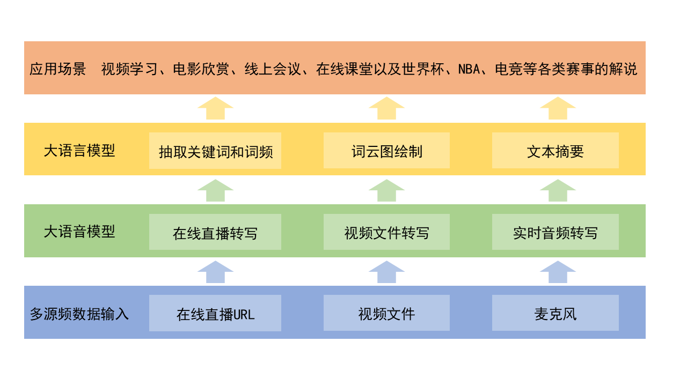

# 视频内容智能感知

## 1. 项目灵感来源

通过调研发现，利用大语言模型处理其他模态数据的缺口很大，应用场景非常广阔，是一个值得研究的方向。举几个例子：

- 你是否经常看到 `800G人工智能全套学习资料，不可错过！` 这种标题的文章？看不完，根本看不完！🫠

- 你是否经常在B站上刷到这种动辄上百小时、几百集的在线视频？学不动，根本学不动！😂

- 你是否经常苦恼跟不上老师或者老板的节奏，恨不得把他们讲的每一个字都记下来？🤔

- 你是否经常因为特殊事情，无法参加线上课堂或者线上会议，而这些线上课堂或者线上会议又没有提供回放？🥲

考虑到以上应用实际，本项目营运而生。本项目名为《视频内容智能感知》，旨在使用大语音模型和大语言模型等前沿技术，将在线直播、离线视频和实时语音等数据源转为文本，并形成文本摘要和关键词，辅助用户快速获取视频的文字内容和核心内容，减少学习成本，提升学习和工作效率！🤓

请大家多多支持，多多关注，多提宝贵意见！🤗

## 2. 项目总体架构介绍

本项目在实现上将`大语音模型`和`大语言模型`进行了有效集成，实现了两个模型的接口组合，为语言模型添加了视频处理能力。总体架构图如下：

## 3. 项目主要功能介绍

- 通过prompts抽取文本摘要

    输入一段文本，实现文本摘要功能。考虑到文本输入长度可能很长，超过大语言模型的输入长度限制，使用Langchain实现文本分割，利用Refine模式实现输入文本的递归式摘要，减少信息损失。【Langchain中的Refine模式如何理解？首先将输入文本按照指定长度分割成多个片段，然后对第一个片段进行总结形成摘要，再把摘要内容和下一个片段组合，进行二次总结，不断重复这个过程直到把所有的片段都遍历完成，形成最终的摘要。】

- 通过prompt抽取文本关键词	

    输入一段文本，实现文本关键词抽取功能。考虑到文本输入长度可能很长，超过大语言模型的输入长度限制，使用Langchain实现文本分割，利用Refine模式实现输入文本的递归式关键词抽取，减少信息损失。

- 文本关键词词云展示	

    通过统计抽取出的关键词在输入文本中的词频，使用echarts实现词云图的展示，直观展示关键词分布情况。

- 在线直播文本转写	

    利用streallink实现在线直播文本转写，支持多个直播平台。使用时仅需输入直播间地址，即可后台通过接口访问直播内容并转写成文本。

- 离线视频文本转写	

    利用大语音模型实现音频文本转写功能，支持用户上传本地视频。考虑到上传的视频较大，实现了视频分割功能，即先将大视频转写成小视频，再将每个小视频的内容转写成文本，最后将所有的文本内容进行组合。

- 实时语音文本转写	
    
    利用Gradio的流式数据处理功能，收集最近5秒的音频数据并生成音频文件，利用大语音模型将保存的音频转写成文本，实现了麦克风输入音频的实时转写。

## 4. 项目运行效果演示

- 直播视频在线分析

  以B站直播为例，用户在url文本框中输入一个直播间的地址，然后点击直播转写按钮即可。

- 视频文件在线分析

  用户首先上传一段本地视频，然后点击分析视频按钮就可。

- 实时音频在线分析

  用户首先点击麦克风，一般浏览器会提示是否允许应用使用音频，点击同意即可。系统会将麦克风的输入近实时的转写成文本，包括电脑内播放的音频和使用麦克风输入的语音。

## 5. 项目部署说明

- 下载项目

  - `git clone https://github.com/freeline55/LLM-Video-Sense.git`

- 创建conda环境
  
  - conda create -n llm-video python=3.10
  
- 安装依赖

  - `pip install -r requirements.txt`

- 启动项目

  - `python app.py`

  - 项目启动后会自动加载语言大模型和Whisper模型，如果本地没有缓存会联网下载，时间较长，请耐心等待，项目默认地址为: `http://localhoost:7860`，使用浏览器打开即可。

## 5. 未来研究工作

- 用户输入视频链接，项目直接将其转写成文本（可能涉及爬虫与下载）；

- 实时音频转写部分目前采用小批（5s）代替实时数据流，未来计划换成音频流转写模型；

- 视频内容较长时摘要时间也较久，计划实现流式摘要，减少用户等待时间；

- 研究识别、提取视频关键章节区间功能，实现分段内容转写与摘要；

- 支持转写文本修改后再生成摘要文本和词云图，同时支持文本转写结果、摘要文本和词云图下载功能；

- 将视频文本内容存入知识库，支持基于知识库的问答；